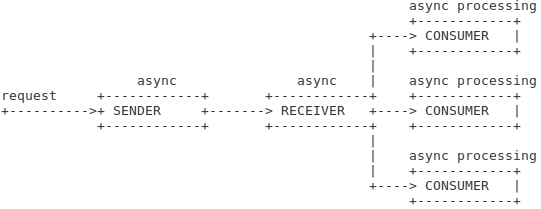

# Retranslator
This is a test work that demonstrates async features of python.
Basic structures of this application are demonstrated on picture below.



### Prebuild
To build this application you must install docker on your system
### Run tests
To run the tests, you need to execute the following commands
```bash
docker build -t testwork_retranslator -f docker/Dockerfile .
docker run -it testwork_retranslator pytest -v /app
```
### Run application
To demo run this application you should execeute the command in the project folder:
```bash
sudo bash ./demo.sh
```
To stop application press `<CTRL>+c`
